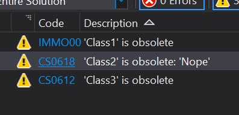
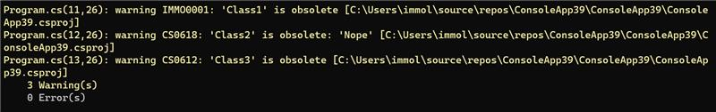
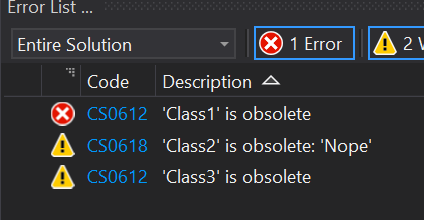

# repro-obsolete-diagnostics

It seems IDE honors the obsolete ID while the CLI build doesn't:





This also causes duplicates in the IDE when building.

Also, the IDE seems to stop honoring the ID as soon as I use an .editorconfig to
alter the severity from warn to error:



## Update

Running

```
dotnet new globaljson
```

```JSON
{
  "sdk": {
    "version": "5.0.100-preview.6.20318.15"
  }
}
```

solves the IDE/CLI mismatch.

However, the issue with wrong diagnostics when using `editor.config` still
exists.